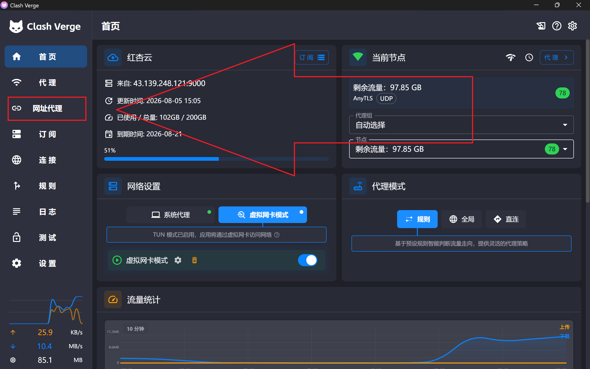

<h1 align="center">
  
  <br>
  Clash Verge（网址代理版）
</h1>

<p align="center">
  基于 <a href="https://github.com/clash-verge-rev/clash-verge-rev">Clash Verge Rev</a> 定制，新增 <strong>「网址代理」</strong> 功能，支持 Windows 与 macOS。
</p>

## 简介

Clash Verge 是一款基于 **Rust + Tauri 2** 的 [Clash Meta (mihomo)](https://github.com/MetaCubeX/mihomo) 图形化客户端，简洁高效，支持系统代理、TUN 虚拟网卡、配置文件增强（Merge / Script）等功能。

> 本项目是官方 [clash-verge-rev](https://github.com/clash-verge-rev/clash-verge-rev) 的定制分支，官方版本的原有功能与本版完全一致，本版额外提供 **「网址代理」** 功能。

## Preview



## 新增功能：网址代理

「网址代理」允许你为**任意网址**单独指定代理节点，而不是让所有流量都走同一个代理组。

### 使用教程

1. 打开左侧菜单的「**网址代理**」页。
2. 在顶部输入框输入网址（例如 `https://example.com`，或 Tor 的 `.onion` 域名），点击「**新建**」。
3. 展开该网址的卡片，从节点列表中**手动点击**选择某个代理节点。
4. 也可以点击「**⚡ 测速**」按钮，测试所有节点对该网址的延迟，并自动选择延迟最低的节点。
5. 点击 **AUTO** 按钮开启自动选择，之后每次进入页面都会自动测速并选中最优节点。

### 功能细节

- **独立代理组**：每个网址对应一个独立的 `URL-Proxy-*` 选择器组，互不影响。
- **Tor 支持**：`.onion` 域名自动标注 TOR 标签，并使用 HTTP 协议。
- **持久化**：网址与节点映射保存在本地，跨环境自动从订阅增强文件恢复。
- **不干扰代理页**：`URL-Proxy-*` 组已被过滤，「代理」页显示不受影响。

## 下载

到 [Release 页面](https://github.com/likangdi-code/clash-verge-url-proxy/releases) 下载对应平台的安装包：

| 平台 | 安装包 |
| :--- | :--- |
| Windows x64 | `Clash.Verge_*_x64-setup.exe` |
| Windows ARM64 | `Clash.Verge_*_arm64-setup.exe` |
| Windows x64（内置 WebView2） | `Clash.Verge_*_x64_fixed_webview2-setup.exe` |
| Windows ARM64（内置 WebView2） | `Clash.Verge_*_arm64_fixed_webview2-setup.exe` |
| macOS (Apple Silicon) | `Clash.Verge_*_aarch64.dmg` |
| macOS (Intel) | `Clash.Verge_*_x64.dmg` |
| Linux x64 (amd64) | `Clash.Verge_*_amd64.deb` / `Clash.Verge-*-1.x86_64.rpm` |

> 内置 WebView2 版体积较大（约 200MB），仅在系统无法安装 WebView2 或企业环境使用。
> Linux 目前仅提供 amd64（x64）安装包。

> ⚠️ **macOS 安装**：本版本未签名、未公证（无 Apple 开发者证书）。首次打开可能提示「无法验证开发者」或「已损坏，无法打开」——这是 Gatekeeper 拦截，**文件并未损坏**。请执行：
>
> ```bash
> xattr -dr com.apple.quarantine "/Applications/Clash Verge.app"
> ```
>
> 然后正常打开；或右键点击应用 → 打开 → 仍要打开。

## 特性

- 基于 Rust + Tauri 2，内置 [mihomo](https://github.com/MetaCubeX/mihomo) 内核，支持切换 Alpha 版本内核
- 简洁美观的界面，支持自定义主题、代理组/托盘图标与 CSS Injection
- 配置文件管理与增强（Merge / Script），语法提示
- 系统代理与守卫、TUN（虚拟网卡）模式
- 可视化节点与规则编辑
- WebDAV 配置备份与同步

## 开发

参见 [CONTRIBUTING.md](./CONTRIBUTING.md)。安装 Tauri 依赖后：

```shell
pnpm i
pnpm run prebuild
pnpm dev
```

## 致谢

- [clash-verge-rev](https://github.com/clash-verge-rev/clash-verge-rev)：本项目的基础
- [zzzgydi/clash-verge](https://github.com/zzzgydi/clash-verge)
- [tauri-apps/tauri](https://github.com/tauri-apps/tauri)
- [MetaCubeX/mihomo](https://github.com/MetaCubeX/mihomo)

## License

[GPL-3.0](./LICENSE)
